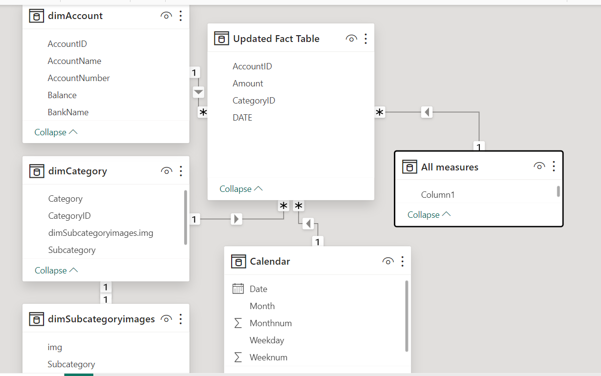
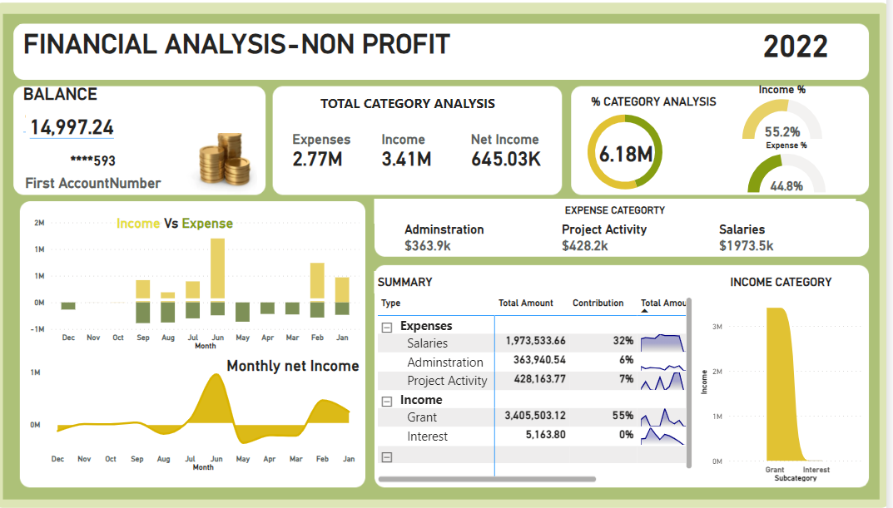

ok# Grant Funds Financial Analysis Project


## Project Overview

This project focuses on analyzing the grant funds of a nonprofit organization to evaluate income and expenditures over a 1-year period. The objective is to ensure that donor funds are being allocated and utilized for the intended purpose. We will analyze and classify expenses to identify the largest expenditure categories and provide data-driven insights. Data will be extracted from SAGE Accounting Package in CSV format, Uploaded, Transformed,modeled, formulate Dax measurements and visualization in power BI.

---

## Table of Contents

1. [Introduction](#introduction)  
2. [Data Sources](#data-sources)  
3. [Data Preparation](#data-preparation)  
4. [Exploratory Data Analysis (EDA)](#exploratory-data-analysis-eda)  
5. [Data Cleaning and Transformation](#data-cleaning-and-transformation)  
6. [Income and Expenditure Classification](#income-and-expenditure-classification)  
7. [Data Modeling in Power BI](#data-modeling-in-power-bi)  
8. [Mockup Dashboard Design](#mockup-dashboard-design)  
9. [Conclusion and Recommendations](#conclusion-and-recommendations)

---

## Introduction

This project aims to analyze the financial records of grant funds to assess their utilization and ensure transparency. By analyzing income sources and classifying expenses into categories (Project Activity, Administration, Salaries), we will highlight the major areas of spending, helping to inform future budgeting decisions.We expect the Dasboard to answer the following Questions.

## Key Questions Addressed by the Dashboard

The dashboard provides insights into the nonprofit's grant fund allocation and utilization by answering the following critical questions:

1. **What are the largest areas of expenditure?**
   - The dashboard will classify and break down all expenses, helping to identify which categories (e.g.,       salaries, project activities, administrative costs) consume the highest percentage of funds.

2. **How effectively are funds being allocated to core activities?**
   - By comparing spending on project activities versus overhead costs (such as salaries and                   administrative expenses), the dashboard will reveal whether funds are being utilized in alignment         with the nonprofit’s mission.

3. **Are funds being received on a regular basis as planned?**
   - The dashboard will visualize the timing of fund receipts throughout the year, identifying any             discrepancies or irregularities in the planned quarterly disbursements.

4. **What are the trends in income and expenditures over time?**
   - The dashboard will display month-to-month trends for both income and expenses, providing insights          into cash flow and revealing any periods of financial strain or surplus.

5. **Which areas of spending require further investigation or adjustment?**
   - Based on the data, the dashboard will highlight areas where spending is disproportionately high or       low compared to expected allocations, indicating where adjustments or further investigation may be         needed to optimize fund usage.

---

## Data Sources

Data will be exported from **Sage** accounting software in CSV format, covering:
- **Income**: Donations, grants, and other revenue
- **Expenses**: Detailed records of expenditures over the past year

---

## Data Preparation

### Steps:
- **Export Data**: Extract raw income and expense data from Sage Accounting Package.
- **Excel Organization**: Create Categories and Subcategories for income and expense.
- **Cleaning**: Clean the data in Excel to ensure it’s ready for analysis.
- **Power BI Import**: Load the cleaned Excel files into Power BI for data modeling and analysis.

---

## Exploratory Data Analysis (EDA)

Before diving into cleaning, we’ll perform an exploratory data analysis to understand the data’s structure and uncover any immediate insights:

1. **Initial Data Review**:  
   - Checked for missing or outlier values.  
   - Verify column types (dates, numeric values, categories).
   - Checked for duplications

2. **Descriptive Statistics**:  
   - Summarize total income and total expenses.  
   - Calculate % ratio for both income and expense records against the total Project Receipt.

3. **Trend Identification**:  
   - Analyze the distribution of expenses over time (monthly,).  
   - Visualize patterns in income flow from different sources.

4. **Basic Data Visualizations (in Excel or Power BI)**:  
   - **Bar Chart**: Total income vs. total expenses.  
   - **Line Graph**: Time-series analysis of monthly cash flows.  
   - **Pie Chart**: Proportion of expenses in each category (Project Activity, Administration, Salaries).

---

## Data Cleaning and Transformation

In the cleaning process, we’ll ensure the data is accurate and structured for analysis:

1. **Handling Missing Data**:  
   - Remove or fill in missing values where applicable.  
   - Drop duplicate entries.

2. **Standardizing Fields**:  
   - Ensure consistent date formatting.  
   - Standardize monetary values across income and expenditure records.

3. **Organizing Data into Excel Files**:  
   - Separate files for income and expenses.  
   - Aggregate categories where necessary for simplification.

---

## Income and Expenditure Classification

**Expenses will be classified into three categories**:

1. **Project Activity**: Expenses directly tied to program and project execution.
2. **Administration**: Overhead costs such as office supplies, rent, and utilities.
3. **Salaries**: Compensation for staff, including wages, benefits, and allowances.

This classification will help us assess where the bulk of the funds are being spent, enabling us to provide better insights into the organization's financial health.

---

## Data Modeling and DAX Calculation in Power BI

In Power BI, we’ll perform the following steps:

1. **Data Modeling**:
   - Create relationships between income and expense data.
   - Add calculated columns (e.g., total income, total expenses, percentage spent on salaries).

2. **KPI Measurements**:
   - Establish the total income received, total expenses, and remaining funds.
   - Measure the percentage of funds contributed by each category (Project Activity, Administration, Salaries).
  
3. **DAX Calculations**:
 ```sql

- Total Amount = 
    SUM('Updated Fact Table'[Amount])


- Expense % =
    DIVIDE([Expenses], [Total Amount])

- Income % = 
    DIVIDE([Income], [Total Amount])

- Net Income = 
    [Income] - [Expenses]


 - Expense neg = 
    CALCULATE([Total Amount], dimCategory[Type] = "Expenses") * -1

- Expenses = 
    CALCULATE([Total Amount], dimCategory[Type] = "Expenses")

- Income = 
    CALCULATE([Total Amount], dimCategory[Type] = "Income")


-   Contribution = 
    VAR _allvalue =
        CALCULATE(
            [Total Amount],
            ALL(dimCategory[Type]),
            ALL(dimCategory[Category])
        )
    RETURN
        DIVIDE([Total Amount],  _allvalue)


- Total Amount Formatted = 
    FORMAT([Total Amount], "$#,.0,k")

- Total Balance = 
    Sum(dimAccount[Balance])

- Calendar = 
ADDCOLUMNS(
    CALENDARAUTO(),
    "Year", YEAR([Date]),
    "Month", FORMAT([Date], "mmm"),
    "Monthnum", MONTH([Date]),
    "Weekday", FORMAT([Date], "ddd"),
    "Weeknum", WEEKDAY([Date])
)
```     

---

## Template Dashboard Design from FIGMA

The dashboard will present an interactive view of the income and expenditure data. Suggested visuals include:

1. **Income vs. Expense Breakdown**:  
   - **Bar Chart**: Comparing total income to total expenditure for the year on a monthly basis.

2. **Category Breakdown of Expenses and Income**:  
   - **Donut/Pie Chart**: Visualizing the proportion of funds spent on Project Activity, Administration,          and Salaries.

3. **Monthly net Cash Flow Analysis**:  
   - **Line Chart**: Displaying monthly income vs. expenses to show trends over the year on a monthly             basis.

4. **Top Expense Categories**:  
   - **Slicers**: Highlighting which category (Project Activity, Administration, or Salaries) had the largest portion of total spending.


---

## Conclusion and Recommendations

# Final Dashboard




## Key Findings from Grant Fund Analysis

After completing the analysis of the nonprofit's grant funds, the following insights were gathered:

   - **Misalignment of Fund Utilization**: A significant portion of expenses (32%) was allocated to             **salaries**, while only **7%** went toward **project activities**. This disparity raises                    concerns, as project activities are the core focus of the nonprofit. Regardless of whether this            was budgeted or not,it indicates that the majority of funds were not being used for the                   project's primary objectives.
  
   - **Irregular Fund Receipts**: Although funds were intended to be drawn quarterly, there was no                identifiable pattern in how the funds were received.This inconsistency warrants further                   investigation, as it may affect the organization’s ability to plan and allocate resources                 effectively.

### Challenges:
   - Due to the lack of access to the **budget** and **prior year data**, I was unable to conduct certain       financial measures, such as:
   - **Variance Analysis**: To compare actual spending with budgeted figures.
   - Analysis of any **increase or decrease in expenses** or **income** over time.

### Recommendations:
   - **Optimize Fund Allocation**: There is a need to reallocate funds more effectively by reducing             overhead (such as salaries) and increasing the allocation toward project-related activities. This          will ensure that funds are aligned with the core mission of the nonprofit.
  
   - **Improve Financial Transparency**: Implementing a more consistent and trackable system for                receiving funds (e.g., quarterly disbursements) is crucial.This will help in better financial              planning and forecasting for future periods.

   - **Follow-Up with Program Teams**: These findings should be discussed with program managers to ensure       proper adjustments in the upcoming year's financial planning. Their input is essential in aligning       financial goals with the project’s objectives and improving fund utilization moving forward.


